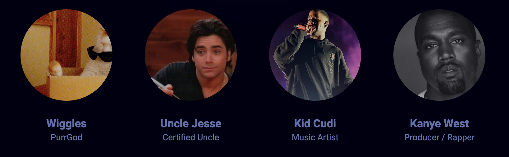
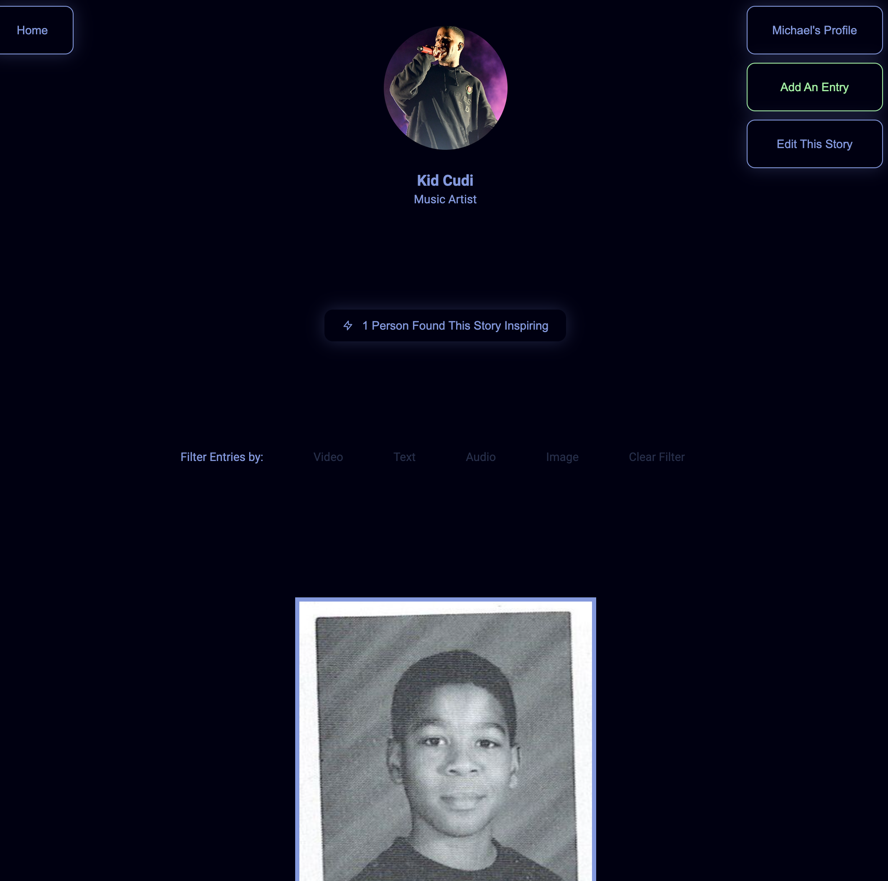
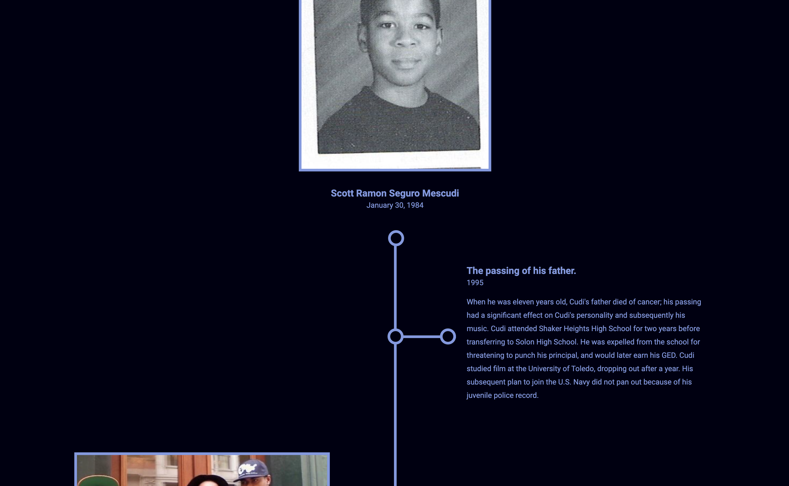
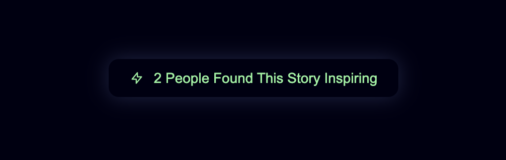
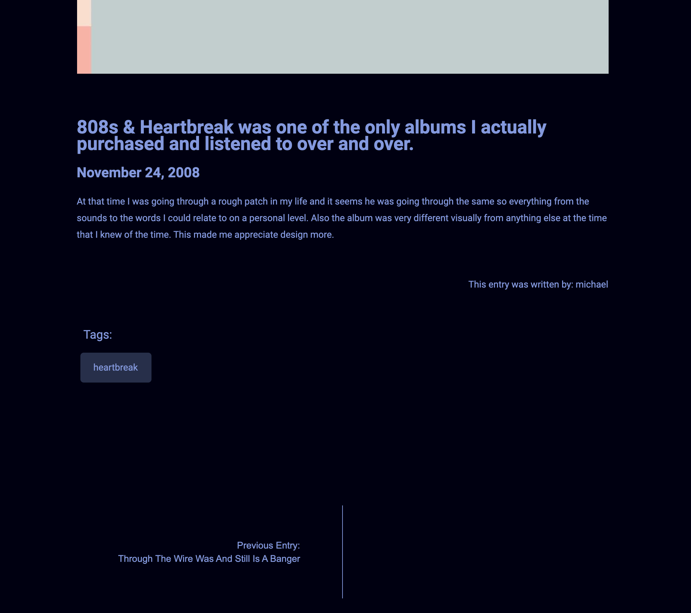
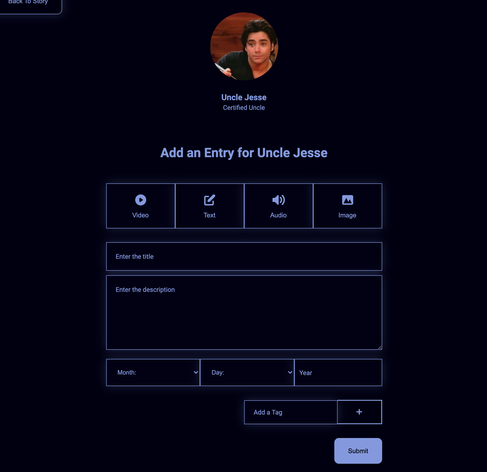
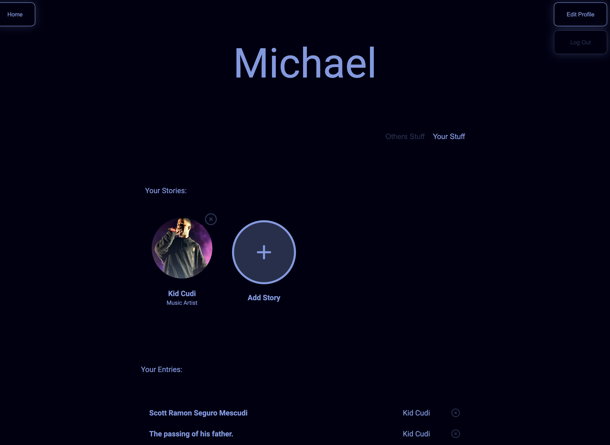
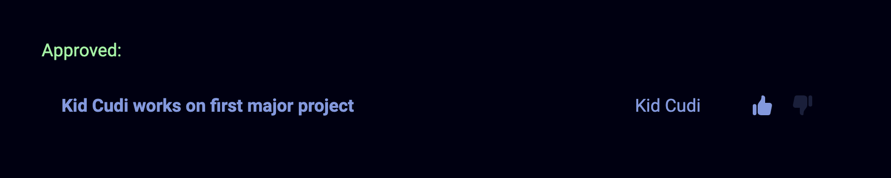
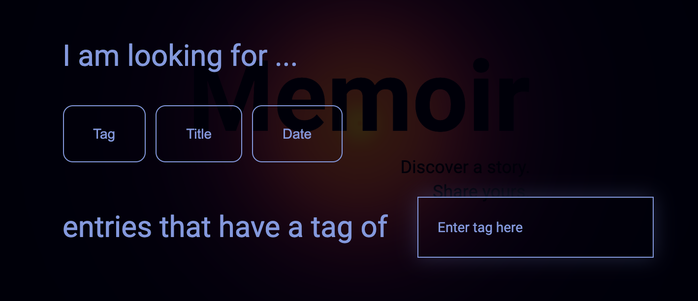
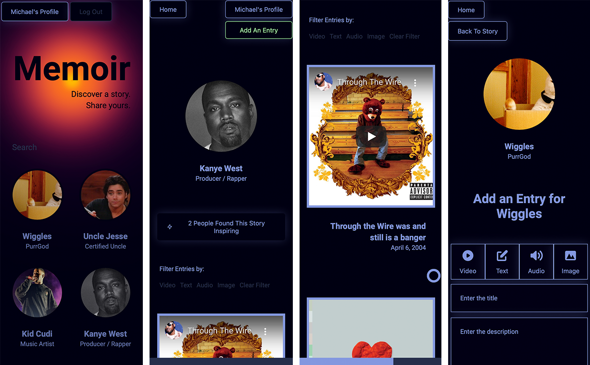

[](https://app.netlify.com/sites/memoirapp/deploys)


# Memoir

Discover a story. Share yours.

See deployed version here: [Memoir App](https://memoirapp.netlify.app/)

## Table of contents

- [Table of contents](#table-of-contents)
- [Features](#features)
- [Frontend](#frontend)
  - [Some notes about the Front end](#some-notes-about-the-frontend)
  - [Usage and Installation](#usage-and-installation)
  - [Testing](#testing)
  - [Dependencies](#dependencies)
- [Backend](#backend)
  - [Notes About the Backend](#some-notes-about-the-backend)
  - [Prerequisites](#prerequisites)
  - [Usage and Installation](#usage-and-installation)
  - [Entity Relationship Diagram](#entity-relationship-diagram)
  - [Creating the Databases](#creating-databases)
  - [Setting your environment variables](#setting-your-environment-variables)
  - [Seeding your new database](#seeding-your-new-database)
  - [Authentication and Encryption](#authentication-and-encryption)
  - [Testing](#testing)
  - [Dependencies](#dependencies)


---

## Features

#### Home
**Stories** are all listed out in the front page



#### Story
Each Story has it's own page with a unique URL



#### Entries
Each Story has **Entries** that are shown on a timeline in chronological order



#### Inspired Button
Each Story can be marked as **inspiring** to recommend to others



#### Single Entry View
Each Entry in the Story can be viewed on it's own page.
This single Entry view shows a presentation mode to look through the other Entries in the Story.



#### Foreign Entries
A person can add an Entry to any Story. If an Entry is added to someone else's Story then it must be approved before it is shown.



#### Profile
Every signed in user will have a profile page where they can see the Stories and Entries they have created.



#### Approve/Deny Foreign Entries
The profile has a seperate section with foreign Entries that need to be approved in order to be shown on their timeline.



#### Search
If you're looking for an Entry with a specific tag, title, or date then there is a search feature on the Home page that can help.



#### Mobile Friendly
Memoir was also adapted to be mobile friendly.




## Frontend

|  |  |  |  |
| ---------------------------------------------------- | -------------------------------------------------------------------- | --------------------------------------------------------------------------------------- | ------------------------------------------------------------------------ |

### Some notes about the Frontend

The frontend is deployed on Netlify. Memoir uses a React frontend that uses Redux to store it's global state and Sass for styling.

### Usage and Installation

```
$ git clone https://github.com/hector4213/memoir.git (if you haven't already)
$ cd client
$ npm install
$ npm start
```

## Testing

|  |  |
| ------------------------------------------------------------------ | ---------------------------------------------------------- |

Memoir uses Storybook to test the component User Interface and Cypress for end to end testing to make sure all core fearures are working.

To run Storybook

```
$ npm run storybook
```

To run Cypress

```
$ npm run cypress
```

### Dependencies

- sass
- redux
- redux-thunk
- react-redux
- react-router
- react-icons
- storybook
- cypress
- axios

## Backend

|  |  |  |  |
| ---------------------------------------------------- | ------------------------------------------------ | ----------------------------------------------------- | ------------------------------------------------ |

### Some notes about the Backend

The backend portion of this application is currently deployed on heroku so please be patient with the cold start time. For the Database, PostgreSQL is used along with [Objection.js](https://vincit.github.io/objection.js/), although Objection.js is most commonly known as an ORM, it would be more accurate to call it a a **relational query builder**. You get all the benefits of an SQL query builder but also a powerful set of tools for working with relations.

Objection.js is built on the SQL query builder [knex](https://github.com/knex/knex). All databases supported by knex are supported by Objection.js. SQLite3, Postgres and MySQL.

### Authentication and Encryption

Memoir uses [Jsonwebtokens](https://github.com/auth0/node-jsonwebtoken), for authentication and [bcrypt](https://github.com/kelektiv/node.bcrypt.js/) for hashing passwords and storing it in the Database.

### Prerequisites

- PostgreSQL version 12.4^ download [here](https://www.postgresql.org/download/)
- [Node.js](https://nodejs.org/en/download/) with npm

### Usage and Installation

    $ git clone https://github.com/hector4213/memoir.git (if you haven't already)
    $ cd server
    $ npm install
    $ npm run dev

### Entity Relationship Diagram


### Creating Databases

You can either create databases using the command-line / terminal if using the terminal is not in your comfort zone,
use a GUI client such as [pgAdmin4](https://www.pgadmin.org/download/)

For more information on how to create databases using PostgreSQL see this [article](https://www.guru99.com/postgresql-create-database.html) with instructions on how to create databases using the GUI or terminal.

### Setting your environment variables

- See env.example for required environment variables

_Only one database is needed for the backend application to run, creating a second database for testing purposes is optional, but reccommended_

### Seeding your new database

Ensure you are in the /server directory and type

    $ knex migrate:latest

This command will create tables for the database, to seed the database type

    $ knex seed:run

To reset the database to its original application state type

    $ npm run resetdb

### Testing

|  |  |
| ------------------------------------------------------------------------------------ | ----------------------------------------------------------------------------- |

To run tests type

    $ npm test

Memoir uses Mocha as a test runner and Chai for assertions.

### Dependencies

- bcrypt
- dotenv
- express
- jsonwebtoken
- knex
- morgan
- objection
- pg
- yup
